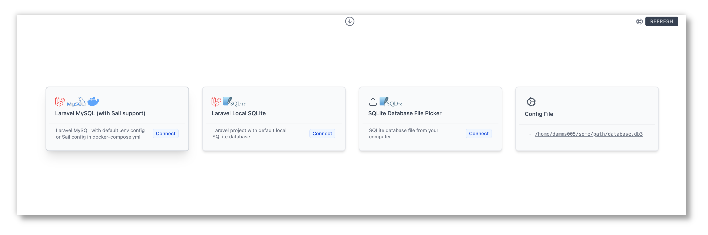
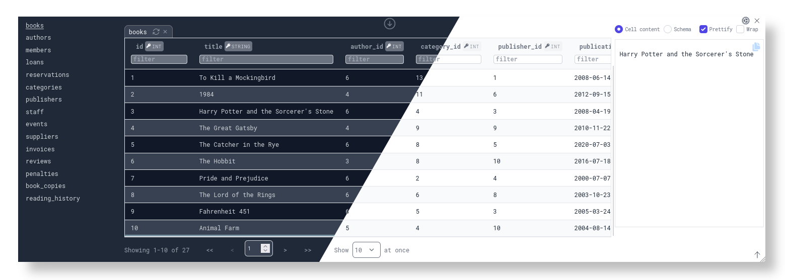
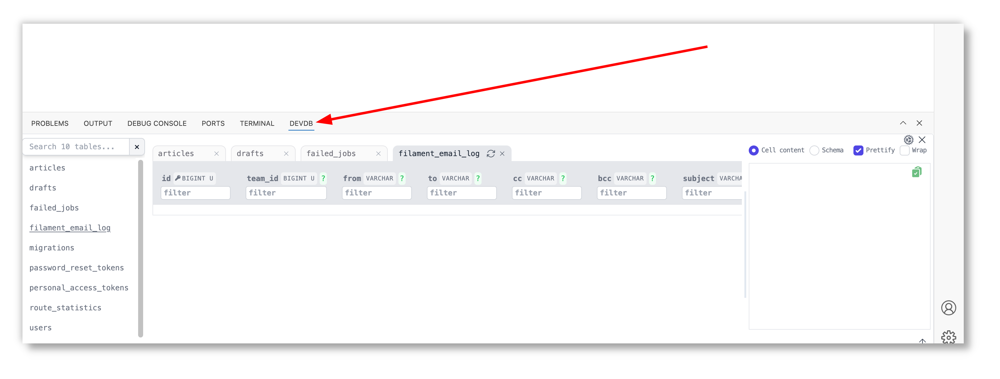
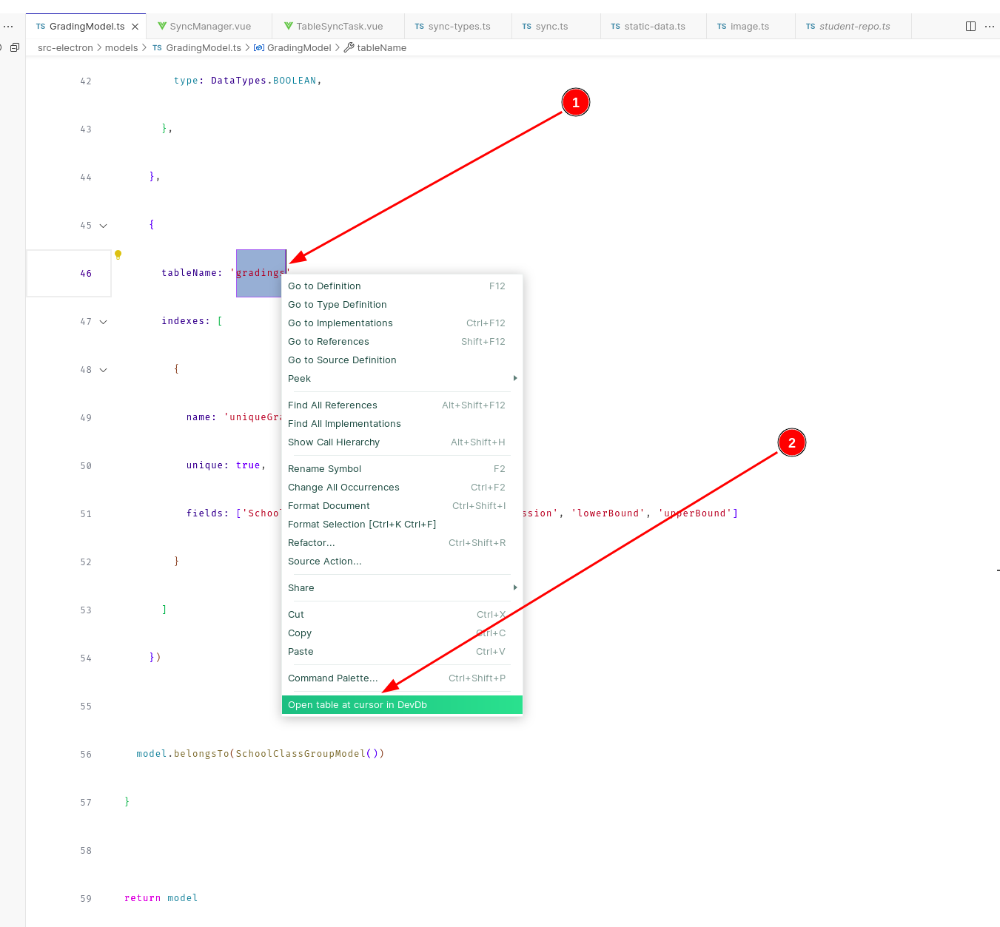
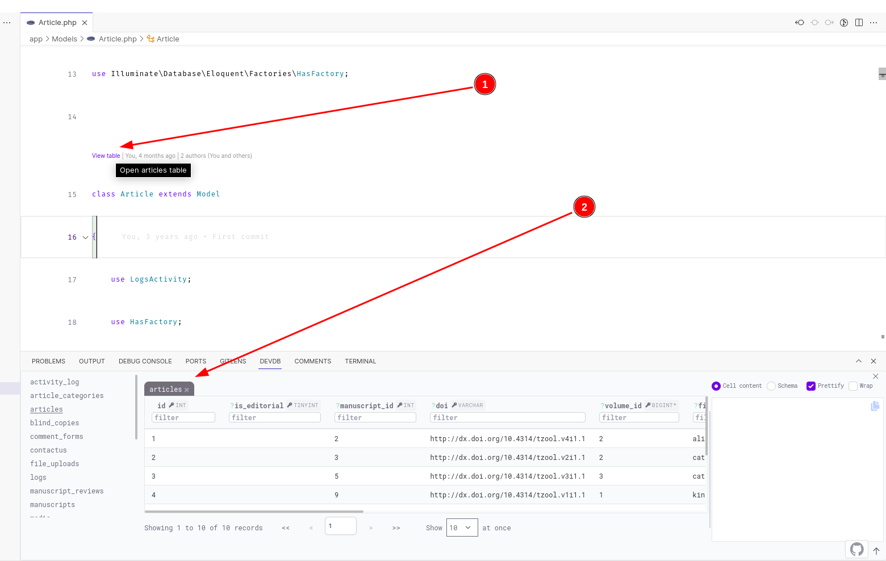

# [DevDb](https://marketplace.visualstudio.com/items?itemName=damms005.devdb)





A lightweight VS Code extension that auto-loads your database. It provides a beautiful database GUI client experience, bringing [Convention over Configuration](https://en.wikipedia.org/wiki/Convention_over_configuration) into database management.

Built with 💖 for developers.

## Requirements

- VS Code 1.83 or newer
- A VS Code project that uses any of the [supported databases](#supported-databases)

## Supported OSes/Platforms:
- Linux (Linux-x64, Linux-arm64, Linux-arm, Alpine-x64)
- macOS (Darwin-x64, Darwin-arm64 Apple Silicon)
- Windows (Win32-x64)

## Quick Start

- In a VS Code project using any of the [supported databases](#supported-databases), ensure your database is properly set up and you are able to connect to your database as usual from your normal app code.
- DevDb [loads your database](#loading-databases). You can view your database by opening the DevDb (usually before the Terminal tab) as shown in the screenshot below, or by using the [shortcut](#keybinding):




> [!NOTE]
> Additionally, DevDb provides some [Language and Framework Integrations](#language-and-framework-integrations)

## Loading databases

DevDb can automatically load your database using connection details from your VS Code workspace ([zero-config](#1-zero-config-automatic-database-loading) mode). When zero-config support is not available for your development environment, [configuration file](#2-config-based-database-loading) option is available. These two options are explained below:

### 1. Zero-config (automatic database loading)

No [configuration file](#2-config-based-database-loading) is needed for these environments:

1. Laravel with local default SQLite database
1. Laravel MySQL/MariaDB with default .env config
1. Containerized Laravel MySQL (Laravel Sail) with config in default .env/docker-compose.yml (including [dev containers](https://code.visualstudio.com/docs/devcontainers/containers) support)
1. Laravel Postgres with default .env config
1. Laravel Microsoft SQL Server with default .env config

### 2. Config-based database loading

If there is no [zero-config](#1-zero-config-automatic-database-loading) support for your environment, simply provide a `.devdbrc` file in the root of your project containing your database connection details.

> [!WARNING]
> Do not forget to exclude the `.devdbrc` config file from being version controlled. e.g. by adding it to the `.gitignore` file.

The content of the configuration file should be a single array containing database connection objects. DevDb provides rich editing features for the `.devdbrc` file:

- **JSON Schema Validation**: Your configuration is automatically validated against a schema
- **IntelliSense**: Get autocompletion for all fields, including the `type` field
- **Snippets**: Quickly insert configuration templates:
  - `devdb mysql`: MySQL configuration
  - `devdb mariadb`: MariaDB configuration
  - `devdb postgres`: PostgreSQL configuration
  - `devdb sqlite`: SQLite configuration
  - `devdb mssql`: Microsoft SQL Server configuration

#### Configuration file example

```
[
  {
    "name": "My test MySQL database", // <-- to identify the connection
    "type": "mysql",
    "host": "<host>",
    "port": "<port>",
    "username": "<username>",
    "password": "<password>",
    "database": "test" // <-- the database to show in VS Code DevDb view
  },
  {
    "type": "sqlite",
    "path": "/home/path/to/database.sqlite"
  }
]
```

> [!TIP]
> You may not want to commit DevDb config file to your version control in case other devs in your team are using different database connection details in their local environments.

## Keybinding

Press `Ctrl+K Ctrl+D` to toggle DevDb view

## Supported Databases

The following databases are currently supported:

- SQLite
- MySQL
- MariaDB
- *Postgres
- Microsoft SQL Server

<!-- TODO: Remove this when supported at https://github.com/damms005/devdb-vscode/blob/5f0ead1b0e466c613af7d9d39a9d4ef4470e9ebf/src/database-engines/postgres-engine.ts#L90 -->
<small>
* features in the works for Postgres: table column status (i.e. indicates whether primary or optional column), and display of the table creation SQL
</small>

## Language and Framework Integrations
### Context Menu entry
  You can load a table by right-clicking on its name/model/entity from the editor (framework/programming language-agnostic)
  Example from a Node JS app (a [Sequelize model definition](https://sequelize.org/docs/v6/core-concepts/model-basics/#model-definition))

  

### Laravel model Code Lens
   If working in a Laravel project, DevDb provides Code Lens for viewing Eloquent model underlying table.
   *NOTE:* You need to first connect to a database in DevDb for Laravel Code Lens to be available.

  

### Other features
- `Ctrl + Click` (`Meta + Click` on macOS) on a table from the sidebar to open the table in the current tab

## Why DevDb?

Two words: Better DX.

DevDb aims to be a DB GUI client specifically designed for a much better development experience when working with databases.
Specifically, these experiences:

1. For any new project, it is usually required to setup db connection in the app project, **and** then in some other DB client.
2. It is common to frequently tab-in and tab-out of project windows, switching between the IDE and DB client. Sometimes, frequent enough to want to view the DB data directly in the IDE. Think of how you've got your in-built terminal right in the IDE.

Local DX should be better than this.

Also, most of the DB clients are clunky or simply overwhelming, with bells and whistles that are not really useful during local development flow. Usually, being able to simply _view_ DB data is all that is needed during local development.

Furthermore, who doesn't love beautiful UIs? DB clients have evolved to generally not have exciting UIs in my opinion, except just a few with excellent and intuitive UIs.

To address the above, there is a need for a database GUI tool that lives in the IDE, and mostly auto-detects and connects with the database configured in the currently opened workspace. It should be simple, fast, intuitive, and clean.

Hence, DevDb 🚀

## Disclaimer

DevDb does not aim to provide feature-parity with popular GUI database clients. This extension is focused on improving the experience of working with databases during application development.

> [!NOTE]
> VS Code [multi-root workspaces](https://code.visualstudio.com/docs/editor/multi-root-workspaces) are not currently supported. Progress of this feature is [tracked here](https://github.com/damms005/devdb-vscode/issues/68).

## Contribution
> [!WARNING]
> Contributions are currently only accepted for the extension core code only.

> [!NOTE]
> In order to contribute to the extension core, you may need to be conversant with [VS Code Extension Guide](https://code.visualstudio.com/api/extension-guides/overview).

- Fork this repo, then clone your fork to local
- Run `npm install` to install dependencies
- Make you contributions to the codebase locally
- Press `F5` to launch the debugger to test your changes locally
- Run the test suites with `npm run test-services` and ensure existing tests pass (if you added tests with your changes, ensure those pass too)
- Push your changes back to your fork
- Open a PR with your changes to this repo
- Take your flowers! 💐💐🎊🎊🎊