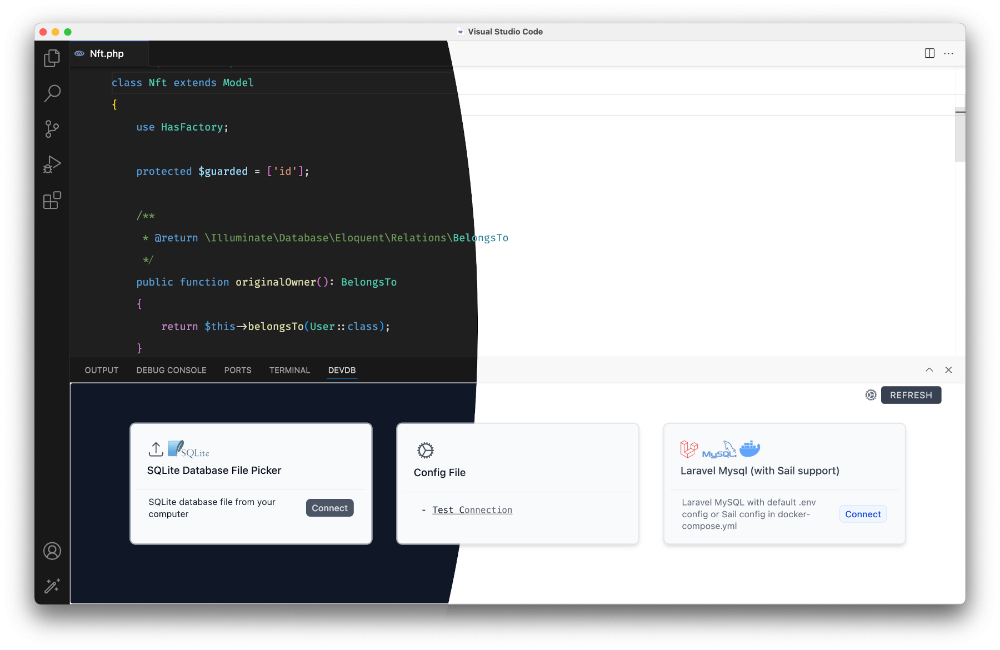
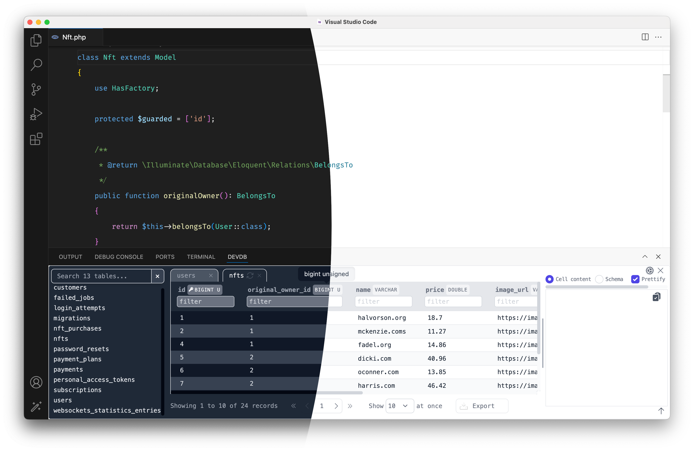
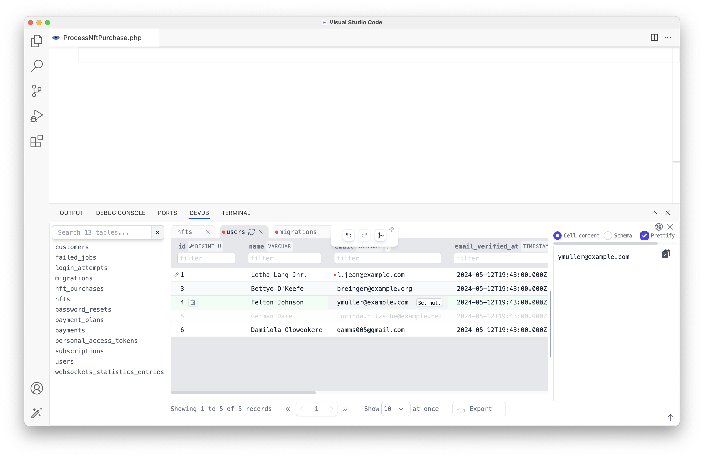
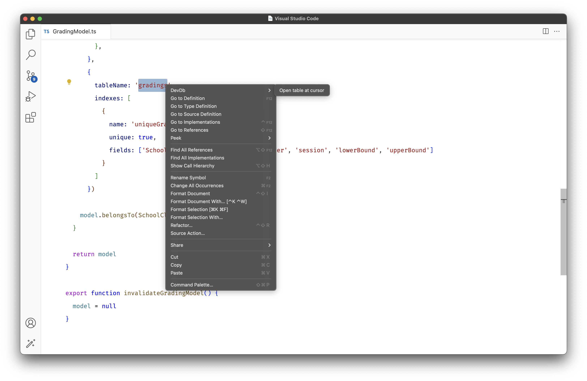
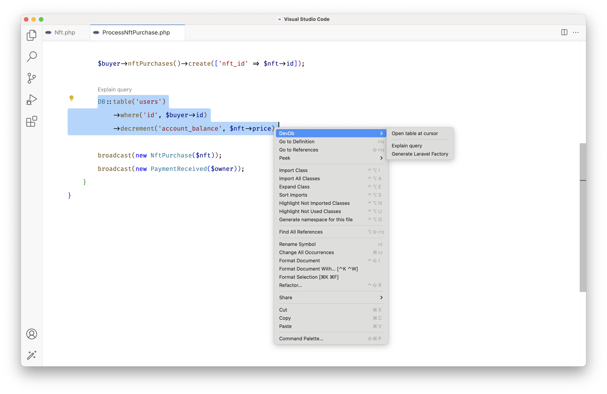

# DevDb

<p align="center">
    <a href="https://github.com/damms005/devdb-vscode/actions"></a>
    <a href="https://marketplace.visualstudio.com/items?itemName=damms005.devdb"></a>
    <a href="https://marketplace.visualstudio.com/items?itemName=damms005.devdb&ssr=false#review-details"></a>
    <a href="https://github.com/sponsors/damms005"></a>
</p>

<p align="center">
    <a href="https://marketplace.visualstudio.com/items?itemName=damms005.devdb">VS Code Marketplace page</a>
		⋅
    <a href="https://open-vsx.org/extension/damms005/devdb">Open VSX Registry page</a>
</p>

A lightweight VS Code extension that auto-loads your database and provides affordances from your database to aid development and debugging. Built with 💖 for developers.

## Latest Features

1. New zero-config support: applications running in DDEV
1. New zero-config support: Adonis (Lucid ORM) - MySQL and PostgreSQL
1. On-click reconnection

## Featured In

<table>
<tr><td>
<a title="Laravel News" href="https://laravel-news.com/devdb">
</a>
</td>
<td>
<a title="DDEV documentation" href="https://ddev.readthedocs.io/en/latest/users/usage/database-management/#database-guis">

</a>
</td>
<td>
<a title="Daily dev" href="https://app.daily.dev/posts/JAhlsLY2E">

</a>
</td>
<td>
<a title="TestDevTools" href="https://testdev.tools/dev-db">

</a>
</td>
</tr>
</table>

## Screenshots




## Requirements

- VS Code 1.83 or newer
- A VS Code project using any of the [supported databases](#supported-databases)

## OS/Platform Support

- Linux (Linux-x64, Linux-arm64, Linux-arm, Alpine-x64)
- macOS (Darwin-x64, Darwin-arm64 Apple Silicon)
- Windows (Win32-x64)

## Quick Start

- In a VS Code project using any of the [supported databases](#supported-databases), ensure your database is properly configured and accessible from your application code.
- For [zero-config environments](#1-zero-config-automatic-database-loading), DevDb [auto-loads your database](#loading-databases). View your database by opening the DevDb view like in the screenshot shown, or by [using the shortcut](#keybinding).

> [!NOTE]
> DevDb also provides several [Language and Framework Integrations](#language-and-framework-integrations)

### UI Actions and Key Map

- `Cmd + K + D` to toggle the view panel
- `Cmd + Click` table name in the sidebar to open the table in the current tab
- `Cmd + Click` on a database value to edit it
- Click any value to preview it in the pane (useful for viewing prettified JSON string values)
- The right pane offers options to view the current table schema or selected value
- During edit sessions (activated during data edit/delete), the control box appears as shown in the screenshot
- During edit sessions: `Cmd + Z` to undo changes, `Cmd + Y` to redo changes, and `Cmd + S` to save changes
- Added new "Suggest New Feature" button

### One-click Actions (Data Manipulation)

- Click the trash icon on a table row to delete it
- Click the `Set null` button on a database value to set the value to `null`



## Supported Databases

Currently supported databases:

- SQLite
- MySQL
- MariaDB
- PostgreSQL\*
- Microsoft SQL Server

<!-- TODO: Remove this when supported at https://github.com/damms005/devdb-vscode/blob/5f0ead1b0e466c613af7d9d39a9d4ef4470e9ebf/src/database-engines/postgres-engine.ts#L90 -->
<small>
* PostgreSQL support for table column status (primary/optional column indicator) and table creation SQL display is in development
</small>

## Loading Databases

DevDb can automatically load your database using connection details from your VS Code workspace ([zero-config](#1-zero-config-automatic-database-loading) mode). When zero-config support isn't available, a [configuration file](#2-config-based-database-loading) option is provided.

### 1. Zero-config (Automatic Database Loading)

No [configuration file](#2-config-based-database-loading) is needed for:

1. Applications managed by [DDEV](https://ddev.com)
1. [Adonis](https://adonisjs.com) using default .env config for MySQL and PostgreSQL (with Lucid ORM)
1. [Laravel](https://laravel.com) with default local SQLite database
1. Laravel with default .env config for MySQL/MariaDB, PostgreSQL, and Microsoft SQL Server
1. Containerized Laravel MySQL (Laravel Sail) with default .env/docker-compose.yml config (including [dev containers](https://code.visualstudio.com/docs/devcontainers/containers) support)

### 2. Config-based Database Loading

If [zero-config](#1-zero-config-automatic-database-loading) support isn't available for your environment, create a `.devdbrc` file in your project root with your database connection details.

> [!WARNING]
> Exclude the `.devdbrc` config file from version control by adding it to `.gitignore`. This protects sensitive information and allows team members to use different database configurations.

The configuration file should contain a single array of database connection objects. DevDb provides rich editing features for `.devdbrc`:

- **JSON Schema Validation**: Automatic configuration validation
- **IntelliSense**: Autocompletion for all fields, including `type`
- **Snippets**: Quick configuration templates:
  - `devdb mysql`: MySQL configuration
  - `devdb mariadb`: MariaDB configuration
  - `devdb postgres`: PostgreSQL configuration
  - `devdb sqlite`: SQLite configuration
  - `devdb mssql`: Microsoft SQL Server configuration

#### Configuration File Example

```json
[
	{
		"name": "My test MySQL database",
		"type": "mysql",
		"host": "127.0.0.1",
		"port": "3306",
		"username": "root",
		"password": "12345",
		"database": "test" // <-- the database to show in VS Code DevDb view
	},
	{
		"type": "sqlite",
		"path": "/path/to/database.sqlite"
	}
]
```

## Tools and Framework Integrations

### Context Menu Entry

Open any database table in DevDb by right-clicking its name/model/entity from the editor in **any** framework/programming language.

Example from a Node.js app



### Laravel

#### Eloquent Model Code Lens

DevDb provides Code Lens features for:

- Viewing the underlying table for the Eloquent model
- Generating a factory for the model (automatically pre-filled with real data from the underlying table)


> [!NOTE]
> Factory Generation is also available via the context menu

#### Query Explainer

The Query Explainer integrates with [MySQL Visual Explain](https://mysqlexplain.com) to optimize SQL queries by analyzing MySQL's query execution plan. Usage:

1. Open a Laravel PHP file containing SQL query (Eloquent or `DB` facade)
2. Select the SQL query to analyze
3. Click the `Explain query` Code Lens or select `Explain query` from the context menu
4. View the explanation in your browser or copy the URL



> [!NOTE]
> VS Code [multi-root workspaces](https://code.visualstudio.com/docs/editor/multi-root-workspaces) support is in development. Track progress [here](https://github.com/damms005/devdb-vscode/issues/68).

## Contribution

> [!IMPORTANT]
> Contributions are currently limited to the extension core code. UI code is not available for public contribution.

1. Fork this repository and clone your fork locally
1. Run `bun install` to install dependencies
1. Make your contributions to the codebase
1. Press `F5` to launch the debugger and test changes locally
1. Run test suites with `bun run test-services` and ensure all tests pass
1. Push changes to your fork
1. Open a PR to this repository
1. Take your flowers! 💐🌺🌹
