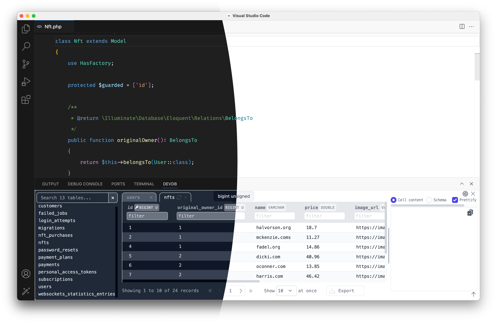

# DevDb

    
    
    
    

    <a href="https://docs.devdbpro.com"><strong>Documentation</strong></a>
    ⋅
    <a href="https://marketplace.visualstudio.com/items?itemName=damms005.devdb">VS Code Marketplace</a>
    ⋅
    <a href="https://open-vsx.org/extension/damms005/devdb">Open VSX Registry</a>

DevDb finds the database of your project and shows it in a panel in VS Code, Cursor and Windsurf. You do not write a connection.

## Features

- **Zero-config detection.** DevDb reads Laravel, Rails, Django, AdonisJS, DDEV, Supabase, Prisma, Drizzle, docker-compose, Wrangler and `DATABASE_URL` setups. [More](https://docs.devdbpro.com/zero-config.html)
- **Browse and edit.** Filter rows, edit values, set `null`, delete rows. Undo, redo and save with `Cmd+Z`, `Cmd+Y` and `Cmd+S`. [More](https://docs.devdbpro.com/getting-started.html#use-the-panel)
- **Editor features.** Go to a table (`Cmd+K Cmd+G`), open the table at the cursor, generate Laravel factories from real data, explain MySQL queries, export as JSON or SQL. [More](https://docs.devdbpro.com/features.html)
- **MCP server.** Claude Code, Cursor, Windsurf and other MCP clients can read your schema and run queries. Localhost only, with a token, read-only by default. [More](https://docs.devdbpro.com/mcp.html)
- **Remote connections** (Pro). Direct with TLS, SSH tunnels with host key checks, and MongoDB. [More](https://docs.devdbpro.com/remote-connections.html)

## Supported datastores

| Datastore | Free | Pro |
|---|---|---|
| SQLite, MySQL, MariaDB, PostgreSQL, SQL Server | Yes | Yes |
| MongoDB that zero-config detection finds | Yes | Yes |
| [Cloudflare D1](https://docs.devdbpro.com/datastores/d1.html) local | Yes | Yes |
| Remote MySQL, MariaDB, PostgreSQL (direct or SSH), remote MongoDB, Supabase Cloud | — | Yes |
| [Redis / Valkey](https://docs.devdbpro.com/datastores/redis.html), [ClickHouse](https://docs.devdbpro.com/datastores/clickhouse.html), [DuckDB](https://docs.devdbpro.com/datastores/duckdb.html), [Neon](https://docs.devdbpro.com/datastores/neon.html) | — | Yes |
| [pgvector search](https://docs.devdbpro.com/datastores/pgvector.html), [Cloudflare D1](https://docs.devdbpro.com/datastores/d1.html) remote, [Turso / libSQL](https://docs.devdbpro.com/datastores/turso.html), [DynamoDB](https://docs.devdbpro.com/datastores/dynamodb.html) | — | Yes |

DevDb Pro is a one-time payment for a lifetime license. See [devdbpro.com](https://devdbpro.com/?ref=ide) and [Pro and Licensing](https://docs.devdbpro.com/pro-and-licensing.html).

## Quick start

1. Install DevDb from the [VS Code Marketplace](https://marketplace.visualstudio.com/items?itemName=damms005.devdb) or [Open VSX](https://open-vsx.org/extension/damms005/devdb).
2. Open your project. Trust the workspace when VS Code asks.
3. Press `Cmd+K Cmd+D` (macOS) or `Ctrl+K Ctrl+D` (Windows, Linux) to open the DevDb panel.
4. Click your database under **Local Databases**.

If DevDb does not find your database, add a [`.devdbrc` file](https://docs.devdbpro.com/config-file.html). Type `devdb` in it to get snippets. Add `.devdbrc` to `.gitignore`, because it can contain passwords.

Requirements: VS Code 1.90 or later. DevDb runs on macOS, Windows, Linux and Alpine (x64 and arm64) and Linux armhf. See [Getting Started](https://docs.devdbpro.com/getting-started.html).

## Documentation

| Topic | Link |
|---|---|
| Install and set up | [Getting Started](https://docs.devdbpro.com/getting-started.html) |
| Frameworks and tools that DevDb detects | [Zero-Config Detection](https://docs.devdbpro.com/zero-config.html) |
| `.devdbrc` reference | [Config File](https://docs.devdbpro.com/config-file.html) |
| SSH tunnels, TLS, MongoDB, Supabase Cloud | [Remote Connections](https://docs.devdbpro.com/remote-connections.html) |
| MCP setup and security | [MCP Server](https://docs.devdbpro.com/mcp.html) |
| All settings | [Settings](https://docs.devdbpro.com/settings.html) |
| Errors and logs | [Troubleshooting](https://docs.devdbpro.com/troubleshooting.html) |
| Report a security problem | [Security](https://docs.devdbpro.com/security.html) |
| Release notes | [Changelog](https://docs.devdbpro.com/changelog.html) |

## Featured in

&nbsp;

&nbsp;

&nbsp;

## Sponsors

- [DevWorkspace Pro](https://devworkspacepro.com): build and manage web apps on your computer, with DDEV, terminal, SSH, GitHub and AI sessions in one desktop app.
- [Traycer AI](https://traycer.ai): AI help in your VS Code workflow.

To support DevDb, [sponsor the project](https://github.com/sponsors/damms005), buy [DevDb Pro](https://devdbpro.com/?ref=ide), or see [other projects](https://damms005.dev/projects).

## Support

- Questions and ideas: [GitHub Discussions](https://github.com/damms005/devdb-vscode/discussions)
- Bugs: [GitHub Issues](https://github.com/damms005/devdb-vscode/issues). Add the log from the **DevDb** output channel.
- License and billing: [hi@devdbpro.com](mailto:hi@devdbpro.com)

## Contribution

> [!IMPORTANT]
> You can contribute to the extension core code only. The UI code is not public.

1. Fork this repository and clone your fork.
2. Run `bun install`.
3. Make your changes. Press `F5` to test them in VS Code.
4. Run `bun run test-services`. All tests must pass.
5. Push to your fork and open a pull request.
