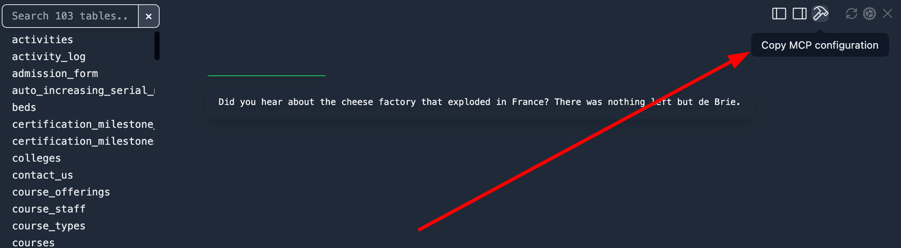
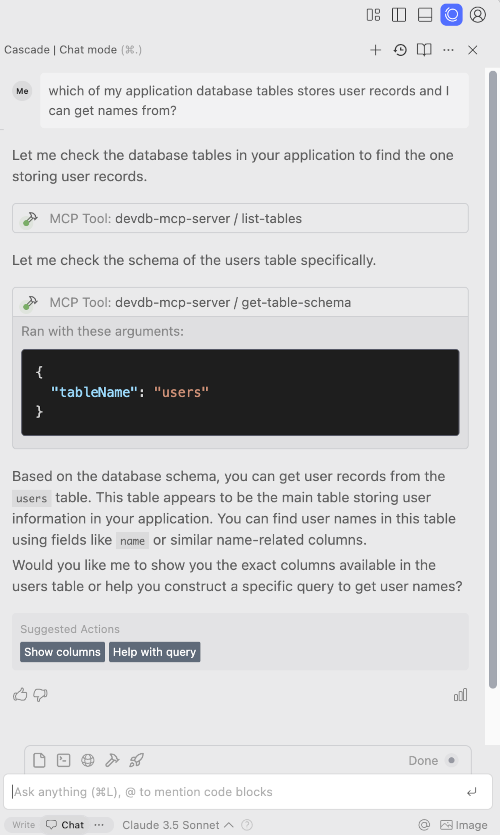

# DevDb

<p align="center">
    <a href="https://github.com/damms005/devdb-vscode/actions"></a>
    <a href="https://marketplace.visualstudio.com/items?itemName=damms005.devdb"></a>
    <a href="https://marketplace.visualstudio.com/items?itemName=damms005.devdb&ssr=false#review-details"></a>
    <a href="https://github.com/sponsors/damms005"></a>
</p>

<p align="center">
    <a href="https://marketplace.visualstudio.com/items?itemName=damms005.devdb">VS Code Marketplace page</a>
		⋅
    <a href="https://open-vsx.org/extension/damms005/devdb">Open VSX Registry page</a>
</p>

A lightweight VS Code extension that auto-loads your database and provides affordances from your database to aid development and debugging.

Built with 💖 for developers.

## Featured In

<table>
<tr><td>
<a title="Laravel News" href="https://laravel-news.com/devdb">
</a>
</td>
<td>
<a title="DDEV documentation" href="https://ddev.readthedocs.io/en/latest/users/usage/database-management/#database-guis">

</a>
</td>
<td>
<a title="Daily dev" href="https://app.daily.dev/posts/JAhlsLY2E">

</a>
</td>
<td>
<a title="TestDevTools" href="https://testdev.tools/dev-db">

</a>
</td>
</tr>
</table>

## Latest Features

1. Allow IDEs (VS Code, Cursor, Windsurf, etc.) to run SQL queries against your application database
1. New zero-config support: applications running in DDEV
1. New zero-config support: Django, Ruby on Rails, and Adonis (Lucid ORM)

## Sponsors

We are genuinely grateful to the following sponsors of DevDb:

- [DevWorkspace Pro](https://devworkspacepro.com) - Desktop app for easily building Docker-powered web apps, with conveniences that supercharge your productivity
- [Traycer AI](https://traycer.ai) - A Powerful AI assistance, natively integrated into your VS Code workflow.

## Features

- **MCP Server:** Provide your database information to AI-powered IDEs and MCP clients like Cursor, Windsurf, etc.

- **Quick table open command:** Press `Cmd+K Cmd+G` (Mac) or `Ctrl+K Ctrl+G` (Windows/Linux) to quickly open any table.

- **Zero-config Database Auto-discovery:** Automatically discover and load your database ― no manual configuration required. Supports environments like DDEV, Adonis, Laravel, containerized setups (Laravel Sail), etc.

- **Database affordances for Local Development:** Because of a deep understanding of your database schema, DevDb is able to provide affordances that aid development and debugging, such as one-click generation of Eloquent Model factories, etc.

- **Powerful IDE Integrations:** DevDb nicely integrates your database with your IDE to provide very useful IDE-powered features like Context Menu & CodeLens Integrations directly in your editor, providing features like opening tables from code, invoking [SQL query explainer](https://mysqlexplain.com) when working on query optimization tasks, etc.

- **Rich Database Client with Intuitive UX:** Dedicated database client view with one-click data browsing, inline editing, deletion, one-click reconnection, etc. Easily modify, set values to null, preview complex JSON data, all within a responsive interface.

- **Data Export:** Export table data as well-formatted JSON or SQL INSERT statements copied to your clipboard or saved to file.

- **Comprehensive Multi-database Support:** Seamlessly interface with SQLite, MySQL, MariaDB, PostgreSQL, and Microsoft SQL Server; with more to come!

- **Intuitive Configuration System:** In environments where automatic [zero-config](#1-zero-config-automatic-database-loading) is unavailable, DevDb provides quick snippets that produce well-formatted templates, as well as JSON Schema validation IntelliSense, which altogether makes creating configuration file for connecting to your database an awesome experience.

- **Integrated Framework & Tool Support:** Tailored support for popular frameworks and tools including Laravel, DDEV, Ruby on Rails, and Adonis ensures a seamless development experience. Need special feature(s) for your environment? [We're listening!](https://github.com/damms005/devdb-vscode/discussions/new?category=ideas).

- **Cross-platform Compatibility:** Engineered to perform consistently on Linux, macOS, and Windows, ensuring maximum flexibility as you can carry on your work across all these platforms.

## Screenshots


## Requirements

- VS Code 1.83 or newer
- A VS Code project using any of the [supported databases](#supported-databases)

## OS/Platform Support

- Linux \*(Linux-x64, Linux-arm64, Linux-arm, Alpine-x64)
- macOS (Darwin-x64, Darwin-arm64 Apple Silicon)
- Windows (Win32-x64)

---

<small>
Ubuntu 20.04 (including equivalent distors) and below are not supported because they have reached EOL and no longer supported runners in GitHub Actions. See https://github.com/actions/runner-images/issues/11101
</small>

---

## Quick Start

- In a VS Code project using any of the [supported databases](#supported-databases), ensure your database is properly configured and accessible from your application code.
- For [zero-config environments](#1-zero-config-automatic-database-loading), DevDb automatically discovers and [auto-loads your database](#loading-databases). View your database by opening the DevDb view like in the screenshot shown, or by [using the shortcut](#keybinding).

> [!NOTE]
> DevDb also provides several [Language and Framework Integrations](#language-and-framework-integrations)

### UI Actions and Key Map

- `Cmd + K + D` to toggle the view panel
- `Cmd + K + G` to go to a table
- `Cmd + Click` table name in the sidebar to open the table in the current tab
- `Cmd + Click` on a database value to edit it
- Click any value to preview it in the pane (useful for viewing prettified JSON string values)
- The right pane offers options to view the current table schema or selected value
- During edit sessions (activated during data edit/delete), the control box appears as shown in the screenshot
- During edit sessions: `Cmd + Z` to undo changes, `Cmd + Y` to redo changes, and `Cmd + S` to save changes
- Added new "Suggest New Feature" button

### One-click Actions (Data Manipulation)

- Click the trash icon on a table row to delete it
- Click the `Set null` button on a database value to set the value to `null`


## Supported Databases

Currently supported databases:

- SQLite
- MySQL
- MariaDB
- PostgreSQL
- Microsoft SQL Server

## Loading Databases

DevDb can automatically discover and load your database using connection details from your VS Code workspace ([zero-config](#1-zero-config-automatic-database-loading) mode). When this zero-config auto-discovery isn't available, a [configuration file](#2-config-based-database-loading) option is provided.

### 1. Zero-config (Automatic Database Discovery)

No [configuration file](#2-config-based-database-loading) is needed when the workspace root contains any of the following:

1. Applications managed by [DDEV](https://ddev.com)
1. [Adonis](https://adonisjs.com) using default .env config for MySQL and PostgreSQL (with Lucid ORM)
1. [Django](https://www.djangoproject.com) with settings.py for SQLite, MySQL, and PostgreSQL
1. [Ruby on Rails](https://rubyonrails.org) with config/database.yml for SQLite, MySQL, and PostgreSQL
1. [Laravel](https://laravel.com) with default local SQLite database
1. Laravel with default .env config for MySQL/MariaDB, PostgreSQL, and Microsoft SQL Server
1. Containerized Laravel MySQL (Laravel Sail) with default .env/docker-compose.yml config (including [dev containers](https://code.visualstudio.com/docs/devcontainers/containers) support)

### 2. Config-based Database Loading

If [zero-config](#1-zero-config-automatic-database-loading) support isn't available for your environment, create a `.devdbrc` file in your project root with your database connection details.

> [!WARNING]
> Exclude the `.devdbrc` config file from version control by adding it to `.gitignore`. This protects sensitive information and allows team members to use different database configurations.

The configuration file should contain a single array of database connection objects. DevDb provides rich editing features for `.devdbrc`:

- **JSON Schema Validation**: Automatic configuration validation
- **IntelliSense**: Autocompletion for all fields, including `type`
- **Snippets**: Quick configuration templates:
  - `devdb mysql`: MySQL configuration
  - `devdb mariadb`: MariaDB configuration
  - `devdb postgres`: PostgreSQL configuration
  - `devdb sqlite`: SQLite configuration
  - `devdb mssql`: Microsoft SQL Server configuration

#### Configuration File Example

```json
[
	{
		"name": "My test MySQL database",
		"type": "mysql",
		"host": "127.0.0.1",
		"port": "3306",
		"username": "root",
		"password": "12345",
		"database": "test" // <-- the database to show in VS Code DevDb view
	},
	{
		"type": "sqlite",
		"path": "/path/to/database.sqlite"
	},
	{
		"name": "My MSSQL database",
		"type": "mssql",
		"host": "localhost",
		"port": "1433",
		"username": "sa",
		"password": "YourPassword123",
		"database": "master",
		"options": {
			"trustServerCertificate": true
		}
	}
]
```

## Tools and Framework Integrations

### Context Menu Entry

Open any database table in DevDb by right-clicking its name/model/entity from the editor in **any** framework/programming language.

Example from a Node.js app


### Laravel

#### Eloquent Model Code Lens

DevDb provides Code Lens features for:

- Viewing the underlying table for the Eloquent model
- Generating a factory for the model (automatically pre-filled with real data from the underlying table)


> [!NOTE]
> Factory Generation is also available via the context menu

#### Query Explainer

The Query Explainer integrates with [MySQL Visual Explain](https://mysqlexplain.com) to optimize SQL queries by analyzing MySQL's query execution plan. Usage:

1. Open a Laravel PHP file containing SQL query (Eloquent or `DB` facade)
2. Select the SQL query to analyze
3. Click the `Explain query` Code Lens or select `Explain query` from the context menu
4. View the explanation in your browser or copy the URL


> [!NOTE]
> VS Code [multi-root workspaces](https://code.visualstudio.com/docs/editor/multi-root-workspaces) support is in development. Track progress [here](https://github.com/damms005/devdb-vscode/issues/68).

<!-- TODO: update when completed -->

### MCP Configuration

1. As shown in screenshot, click the hammer icon to copy the MCP settings.
1. In your IDE's MCP settings file (e.g. `.vscode/mcp.json`, `windsurf/mcp_config.json`, etc.), paste the copied JSON as one of the available MCP servers.

Your IDE/AI-tool should now be able to work with your application's database.




## URI Handler

DevDb provides a custom URI handler that allows you to open specific database tables directly from external applications or links. This is useful for integrating DevDb with other tools or creating shortcuts to frequently accessed tables.

### URI Format

The URI format follows this pattern:

```
vscode://devdb/open/table?connectionId=123&database=main&table=users&workspace=...
```

Parameters:

- `connectionId`: The ID of the database connection
- `database`: The database name
- `table`: The table name to open
- `workspace`: (Optional) The workspace path

## Support

You can support the development of DevDb by [contributing](#contribution) or by [sponsoring the development](https://github.com/sponsors/damms005). We appreciate your DevDb sponsorships with perks. Check the [sponsorship page](https://github.com/sponsors/damms005) for available sponsorship options.

We also appreciate your support by saying 'thank you' to our existing sponsors by patronizing or subscribing to the amazing services they offer:

- [Traycer AI](https://traycer.ai/#pricing1)
- [DevWorkspace Pro](https://devworkspacepro.com)

## Contribution

> [!IMPORTANT]
> Contributions are currently limited to the extension core code. UI code is not available for public contribution.

1. Fork this repository and clone your fork locally
1. Run `bun install` to install dependencies
1. Make your contributions to the codebase
1. Press `F5` to launch the debugger and test changes locally
1. Run test suites with `bun run test-services` and ensure all tests pass
1. Push changes to your fork
1. Open a PR to this repository
1. Take your flowers! 💐🌺🌹
